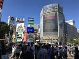
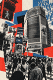
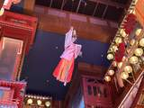
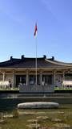
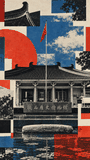
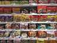

# Press-Print

**A source-aware visual reconstruction system for transforming photographs into contemporary print-driven compositions.**

Press-Print takes a photograph apart and rebuilds it as a bold, layered, graphic image using selective photography, halftone and duotone printing, flat color, controlled collage, source-derived geometry, and modernist editorial hierarchy.

> **Preserve semantic identity, not visual completeness.**

## Why Press-Print exists

Many image-style prompts produce one of two weak outcomes: the original photograph with a filter on top, or a generic poster that loses the identity of the source.

Press-Print is designed around a stricter reconstruction process:

**Disassemble → Recompose → Reassign → Reduce → Hierarchize**

The goal is to keep the source recognizable while making the final image unmistakably reconstructed and non-photographic.

## v1.0 scope

Press-Print v1.0 is intentionally **image-only**.

It does not introduce new typography, captions, place names, dates, slogans, or metadata. Typography support is being kept outside the core system until image reconstruction quality is stable.

## Core principles

- photography is source material, not the final composition
- preserve 1 to 3 source-defining structural anchors
- reconstruct the camera composition instead of merely stylizing it
- use different visual states selectively
- let graphic interventions emerge from the source itself
- use halftone as structure, not as a blanket filter
- use collage as hierarchy, not decoration
- remove information aggressively but intelligently
- preserve modern subjects as modern
- avoid arbitrary poster geometry and fake nostalgia

## Visual states

Press-Print can combine four states within one image:

**PHOTOGRAPHIC**  
Selected recognizable source detail.

**PRINTED**  
Halftone, duotone, high-contrast, screenprint, or offset-like treatment.

**GRAPHIC**  
Flat fields, silhouettes, simplified structures, and abstracted geometry.

**COLLAGED**  
Cut, torn, layered, shifted, or interrupted fragments.

No single state should dominate every region by default.

## Examples

### Urban

| Source | Press-Print |
| --- | --- |
|  |  |

### Landscape

| Source | Press-Print |
| --- | --- |
|  |  |

### Performance

| Source | Press-Print |
| --- | --- |
|  |  |

### Architecture

| Source | Press-Print |
| --- | --- |
|  |  |

### Retail

| Source | Press-Print |
| --- | --- |
|  |  |

## Repository structure

```text
press-print/
├── SKILL.md
├── README.md
├── LICENSE
├── CHANGELOG.md
├── prompt/
│   └── press-print-v1.md
├── eval/
│   └── quality-rubric.md
└── examples/
    ├── urban/
    ├── landscape/
    ├── performance/
    ├── architecture/
    └── retail/
```

## Using it as a Skill

Clients that support `SKILL.md` / Agent Skills can install or copy this repository into their skills directory.

The skill file contains the operational workflow and constraints. The full master prompt is in `prompt/press-print-v1.md`.

For manual image generation, use the master prompt together with a source image.

## Evaluation

Use `eval/quality-rubric.md` to compare models or iterations. It scores:

- semantic retention
- reconstruction strength
- editorial hierarchy
- treatment diversity
- restraint and source discipline

The rubric also defines hard failures such as filter-only output, blanket halftone, hallucinated text, semantic loss, and arbitrary poster geometry.

## Current status

**Version:** 1.0.0  
**Edition:** Image-Only  
**Status:** Initial public release candidate

## Author

Created by **Fan Jiale / Galok**.

## License

MIT. See `LICENSE`.
