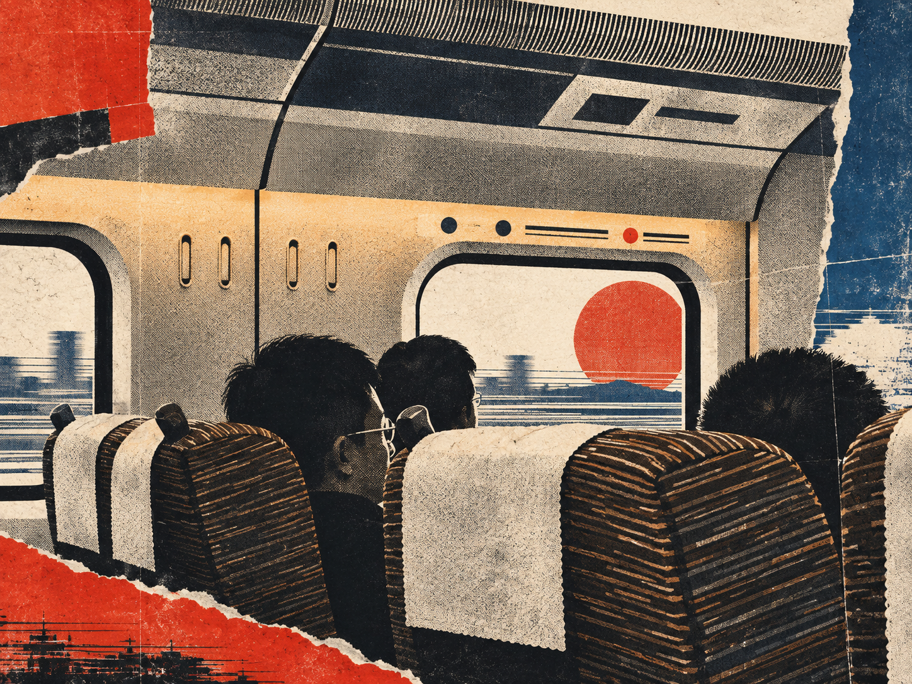
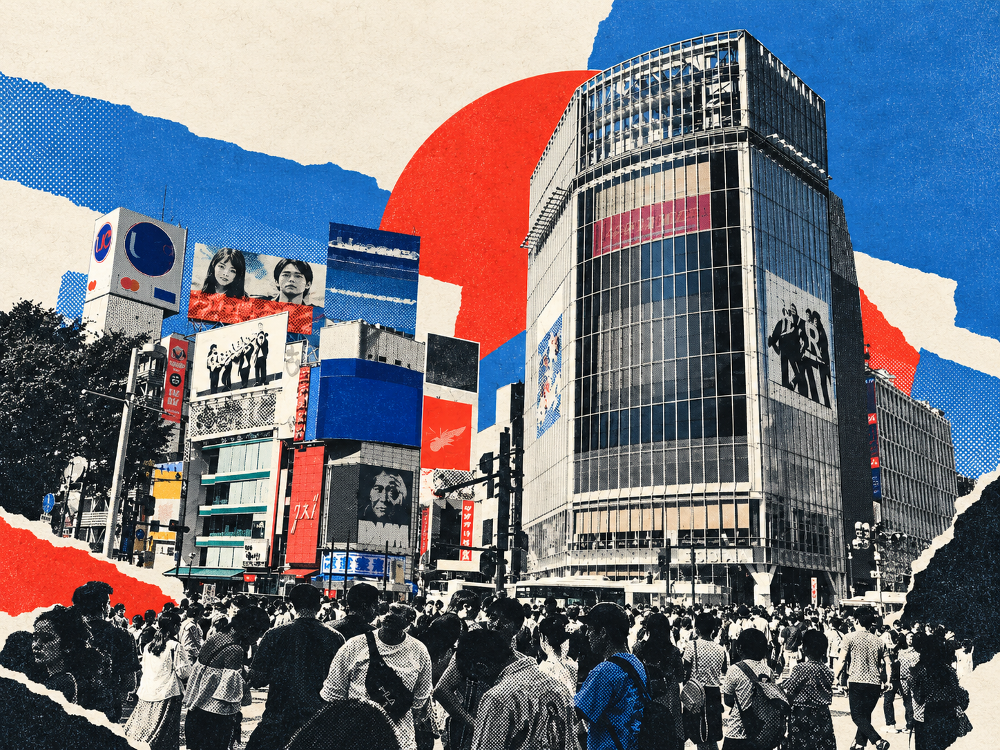
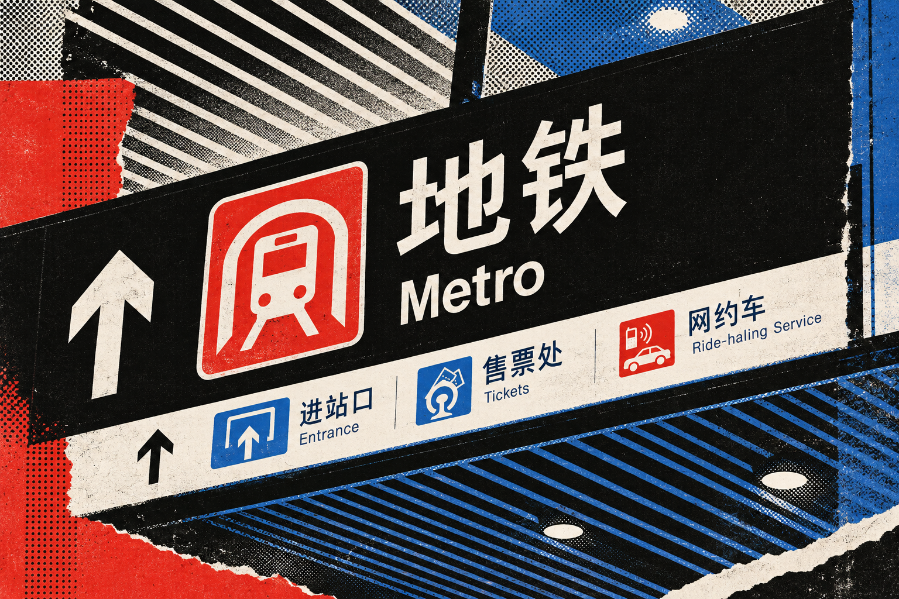
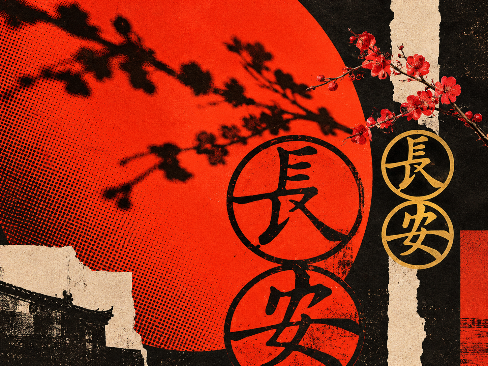
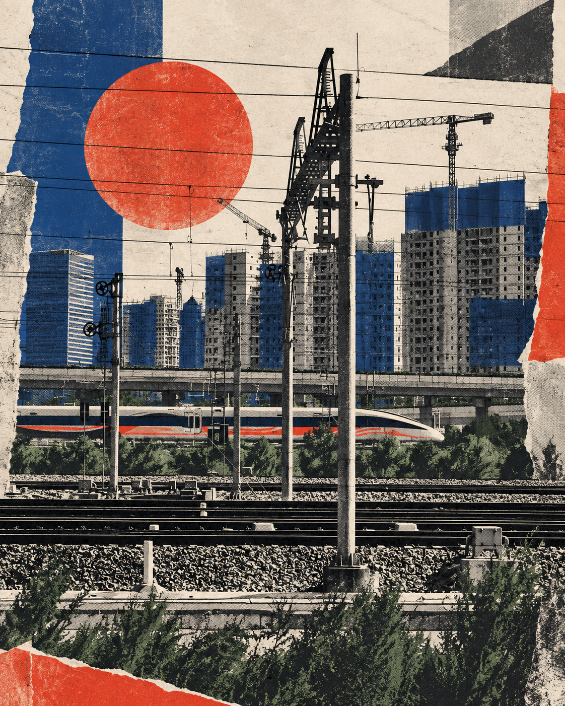
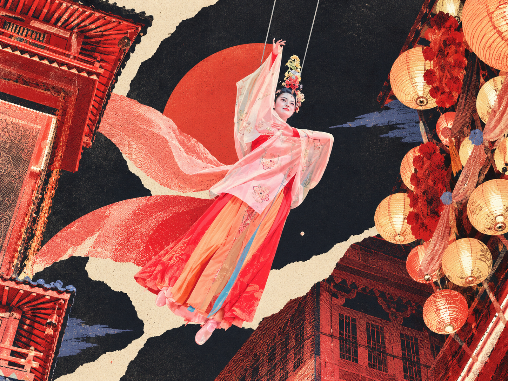
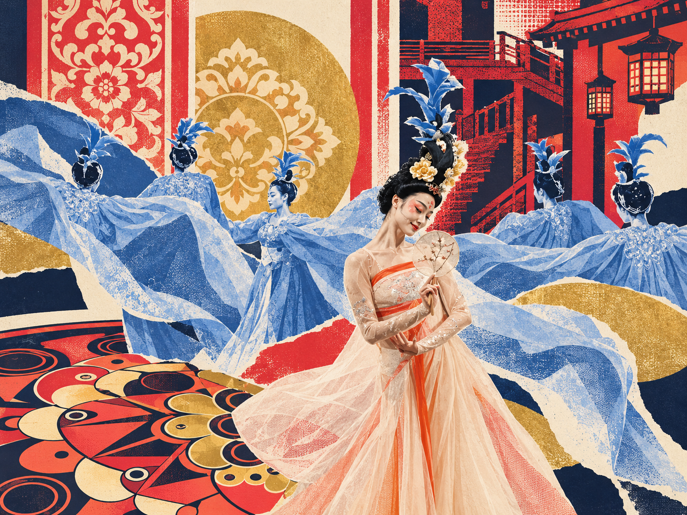
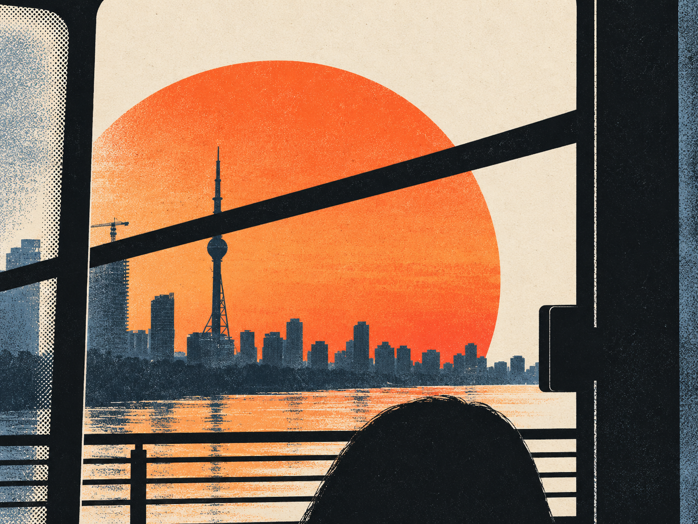
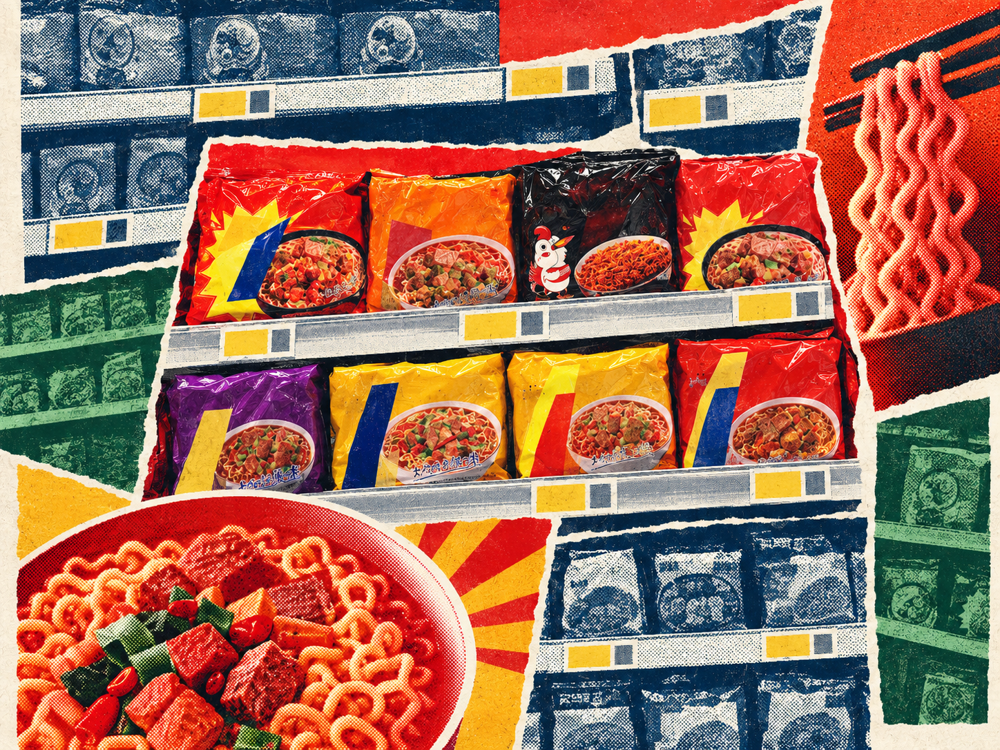

# Press-Print

**A source-aware visual reconstruction system for transforming photographs into contemporary print-driven compositions.**

Press-Print is an open-source **Agent Skill / SKILL.md** for image transformation, image generation workflows, editorial design, halftone, duotone, collage, and contemporary print-driven visual reconstruction.

Press-Print takes a photograph apart and rebuilds it as a bold, layered, graphic image using selective photography, halftone and duotone printing, flat color, controlled collage, source-derived geometry, and modernist editorial hierarchy.

> **Preserve semantic identity, not visual completeness.**

## Install

Press-Print can be installed directly from GitHub. Direct installation does **not** depend on skills.sh or GitHub search indexing.

Check that the skill is discoverable in the repository:

```bash
npx skills add Fanjiale-CN/press-print --list
```

Install Press-Print:

```bash
npx skills add Fanjiale-CN/press-print --skill press-print
```

Repository: `Fanjiale-CN/press-print`  
Skill: `press-print`  
Entry point: `SKILL.md`

If a skill directory or search engine has not indexed this repository yet, use the direct install command above.

## Why Press-Print exists

Many image-style prompts produce one of two weak outcomes: the original photograph with a filter on top, or a generic poster that loses the identity of the source.

Press-Print is designed around a stricter reconstruction process:

**Disassemble → Recompose → Reassign → Reduce → Hierarchize**

The goal is to keep the source recognizable while making the final image unmistakably reconstructed and non-photographic.

## v1.0 scope

Press-Print v1.0 is intentionally **image-only**.

It does not introduce new typography, captions, place names, dates, slogans, or metadata. Typography support is being kept outside the core system until image reconstruction quality is stable.

## Core principles

- photography is source material, not the final composition
- preserve 1 to 3 source-defining structural anchors
- reconstruct the camera composition instead of merely stylizing it
- use different visual states selectively
- let graphic interventions emerge from the source itself
- use halftone as structure, not as a blanket filter
- use collage as hierarchy, not decoration
- remove information aggressively but intelligently
- preserve modern subjects as modern
- avoid arbitrary poster geometry and fake nostalgia

## Visual states

Press-Print can combine four states within one image:

**PHOTOGRAPHIC**  
Selected recognizable source detail.

**PRINTED**  
Halftone, duotone, high-contrast, screenprint, or offset-like treatment.

**GRAPHIC**  
Flat fields, silhouettes, simplified structures, and abstracted geometry.

**COLLAGED**  
Cut, torn, layered, shifted, or interrupted fragments.

No single state should dominate every region by default.

## Showcase

These are the canonical high-resolution v1.0 showcase plates. Each plate is displayed as one complete before/after image exactly as uploaded. Click any image to open the original repository asset at full resolution.

### 01
<a href="examples/showcase/0D0EB3E7-CDA9-4F6C-B8C5-B6613F6CEBCB.png"></a>

### 02
<a href="examples/showcase/2045E30A-8BAE-4625-B726-1EBC31166618.png"></a>

### 03
<a href="examples/showcase/43A519AD-FAA7-40EE-9425-D8EA1CCAA11C.png"></a>

### 04
<a href="examples/showcase/48FEE737-3D46-446B-AAEF-6F1ADB22E70F.png"></a>

### 05
<a href="examples/showcase/52C803C9-C030-4574-8FEF-CE30FDF6A5C4.png"></a>

### 06
<a href="examples/showcase/7AA8CDA5-FC9F-4698-A622-329A248F90FB.png"></a>

### 07
<a href="examples/showcase/8E3C63CD-7AD2-4E0A-A4AD-AB9C82A9044A.png"></a>

### 08
<a href="examples/showcase/A9F371AC-D68C-4BC5-AD10-261487723695.png"></a>

### 09
<a href="examples/showcase/AE838326-B4A9-443E-AF99-B1FE4AB22525.png"></a>

### 10
<a href="examples/showcase/C24DF515-DCB7-4D3A-A871-BDC8F58B38C1.png"></a>

See [`examples/README.md`](examples/README.md) for the showcase note and evaluation guidance.

## Repository structure

```text
press-print/
├── SKILL.md
├── README.md
├── CONTRIBUTING.md
├── LICENSE
├── CHANGELOG.md
├── prompt/
│   └── press-print-v1.md
├── eval/
│   └── quality-rubric.md
└── examples/
    ├── README.md
    └── showcase/
        └── high-resolution v1.0 showcase plates
```

## Using it as a Skill

Clients that support `SKILL.md` / Agent Skills can install or copy this repository into their skills directory.

The skill file contains the operational workflow and constraints. The full master prompt is in [`prompt/press-print-v1.md`](prompt/press-print-v1.md).

For manual image generation, use the master prompt together with a source image.

## Evaluation

Use [`eval/quality-rubric.md`](eval/quality-rubric.md) to compare models or iterations. It scores:

- semantic retention
- reconstruction strength
- editorial hierarchy
- treatment diversity
- restraint and source discipline

The rubric also defines hard failures such as filter-only output, blanket halftone, hallucinated text, semantic loss, and arbitrary poster geometry.

## Contributing

Model comparisons, reproducible failure cases, source/result pairs, and prompt refinements are welcome. See [`CONTRIBUTING.md`](CONTRIBUTING.md).

## Current status

**Version:** 1.0.0  
**Edition:** Image-Only  
**Status:** Public release

## Author

Created by **Fan Jiale / Galok**.

## License

MIT for the Press-Print skill text, prompt system, documentation, and related project materials. See `LICENSE`.

Showcase images are provided for demonstration and evaluation; image rights may depend on their original provenance. See [`examples/README.md`](examples/README.md).
